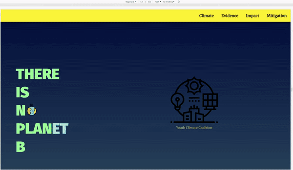

# Landing Page Project

The aim of this front-end focused project was to create a multi-section real-world scenario of manipulating the DOM and to fully combine my HTML, CSS, and JavaScript skills that I had at that particular moment while doing the Front End Web Developer Nanogeree program at Udacity.
Most of the content is being appended dynamically using JS, refactoring and testeing played an important role for this to work-out well in the end.

### Assumed company's description
Youth Climate Coalition is a non-profit organization run by youth for youth, and serving as the youth arm of the Climate Change Mitigation. Its stated mission is "to empower teenagers ages 14-26 to become active community leaders who contribute to making a sustainable society".

## Credits
Special thanks to flaticon.com for providing such great icons for educational and development purposes.
